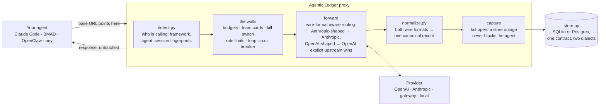
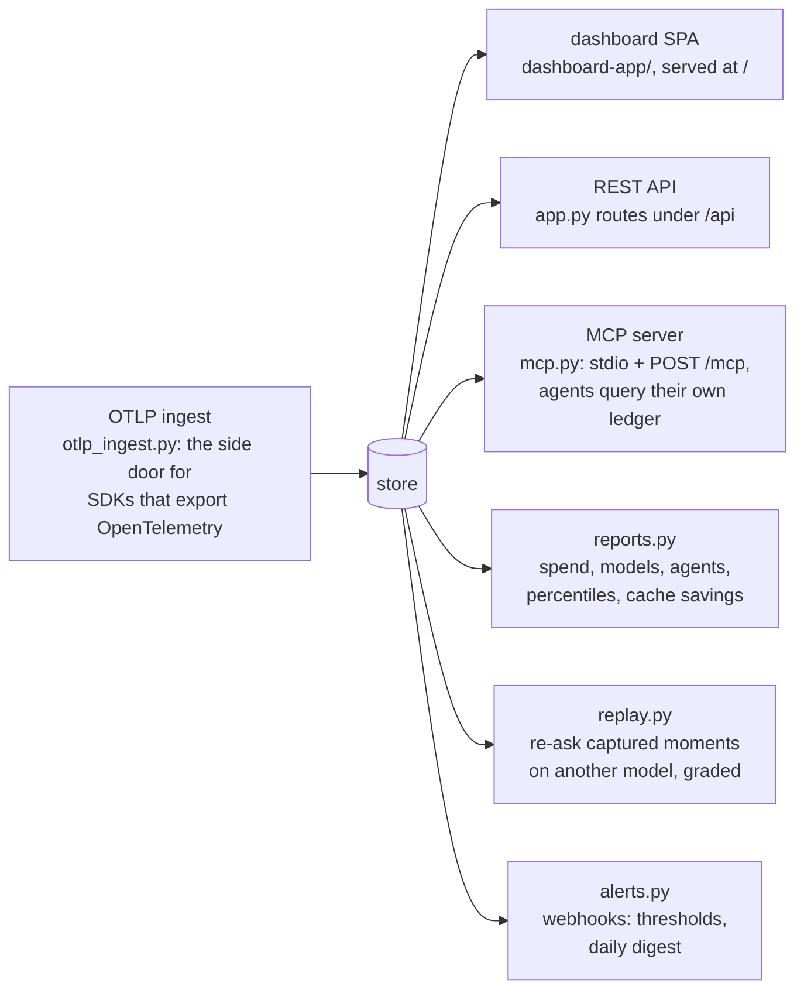

# Architecture

One process, one job: sit between an agent and its model provider,
record everything, and refuse what crosses a line. Everything else
(dashboard, API, MCP, replay, reports) is a reader of what the recorder
wrote.

## The shape of a call

A refused call (budget wall, stopped run) short-circuits at the walls:
it is captured with a `blocked:` reason and answered with 429 or 402,
and the provider never sees it. That is the difference between this and
a dashboard: enforcement happens in the request path.

## The readers

## Module map

| Module | Owns | Change it when |
|---|---|---|
| `proxy/app.py` | HTTP surface: proxying, walls, every `/api` route | new endpoint, new enforcement |
| `proxy/store.py` | persistence, two dialects behind one contract (`_pg_plain` keeps them identical) | schema, queries; always both dialects, CI runs the full suite on real Postgres |
| `proxy/detect.py` | zero-config fingerprints (Claude Code, BMAD, OpenClaw) | teaching a new framework; `POST /api/redetect` backfills history |
| `proxy/normalize.py` | both wire formats → one canonical call record | provider API shape changes |
| `proxy/pricing.py` + `pricing_data/*.json` | cost math + the price packs (plain JSON, PR-friendly) | new model, price change: see docs/pricing.md |
| `proxy/loops.py` | run grouping, thread stitching, loop pathology flags | loop detection behavior |
| `proxy/replay.py` | single-call and whole-run replay, cross-provider translation, report cards | replay behavior, grading |
| `proxy/reports.py` | aggregation for the Reports tab and digests | new report figure |
| `proxy/alerts.py` | webhook firing | new alert type |
| `proxy/otlp_ingest.py` | OTLP JSON + protobuf → calls | new OTel mapping |
| `proxy/mcp.py` | the six MCP tools, both transports | agent-facing querying |
| `config.py` / `service.py` / `cli.py` | toml config, background service, `agenticledger` CLI | operator experience |
| `connect.py` | one-command framework wiring | new framework connector |
| `dashboard-app/` | the React SPA (built into `proxy/static/`) | anything visual |

## Design rules the code holds itself to

- **Fail-open capture.** The proxy exists to observe; if its own storage
  fails, the agent's call still goes through. Enforcement is the only
  thing allowed to say no, and it says so honestly (`blocked:`).
- **One store contract.** SQLite and Postgres return byte-identical
  shapes; CI runs the entire suite against real Postgres so they cannot
  drift. Ids are opaque TEXT everywhere (a lesson learned twice).
- **Zero config is literal.** No upstream configured means routing by
  wire format; no database configured means one fixed home path. An
  explicit setting always wins over cleverness.
- **Red means the agent broke.** The ledger's own refusals are amber
  `blocked:`, provider hiccups are `transient:`, client probes are
  `probe:`; none of them count as errors anywhere.
- **Fixes ship as product.** Data corrections are endpoints and
  migrations with tests and audit logs, never hand-run SQL.
- **Measured, not promised.** Performance and cost-math claims trace to
  `scripts/loadtest.py`, the golden pricing tests, and docs/accuracy.md.

## Where the bodies are buried (honest limitations)

- Replay is answer-only: nothing a replayed model says is executed, and
  each step is graded inside the original run's context. See the README
  section on replay for why that is the honest design.
- The kill switch's in-memory stop set is per-process; with multiple
  replicas (unsupported today, see docs/deployment.md), the marker
  persists but other replicas pick it up on restart.
- Loop inference is heuristics over traffic. It is deliberately
  conservative and flags rather than concludes.
