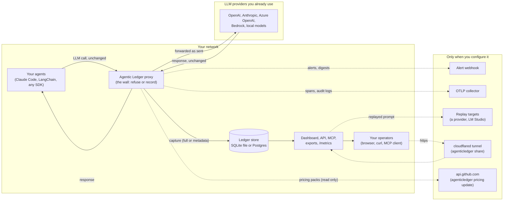

# Data flow

Every hop data takes through an Agentic Ledger deployment, what is stored,
and what leaves the box. Solid arrows always happen; dashed arrows happen
only when you configure them.

## The path every call takes

1. **Agent to proxy.** The agent's base URL points at the proxy. The
   request arrives with the agent's own provider key in its headers.
2. **The wall.** Before anything is forwarded, the proxy either refuses
   the call (stop all calls, allow and deny lists, rate limits, loop
   guards, the per-run kill switch, run ceilings, budgets) or lets it
   through unchanged. The ledger never modifies, compresses, reroutes, or
   substitutes a call. Every refusal is recorded with its reason.
3. **Proxy to provider.** The request is forwarded to the upstream you
   configured (`AGENTICLEDGER_UPSTREAM_URL`, or routed by wire format
   when unset) with the agent's key, which is used for that request and
   never stored.
4. **Capture.** The request and response are normalized and written to
   the store, with cost computed from local pricing packs. Streaming
   responses are relayed as they arrive and captured when complete.
5. **Readers.** The dashboard, the JSON API, the MCP server, the
   compliance export, and `/metrics` read from the store. Reads of
   captured content (a session, a call, a search, the reports, an
   export, an MCP tool call) are audited actions.

## What is stored

| Setting | What the store holds per call |
|---|---|
| `AGENTICLEDGER_CAPTURE_LEVEL=full` (default) | Model, provider, timestamps, tokens, cost, latency, status, agent and session attribution, the system prompt, the messages, the tool definitions and tool results, the response content and tool calls, loop-inference fields. |
| `AGENTICLEDGER_CAPTURE_LEVEL=metadata` | The same minus every content field: no prompts, no responses, no tools. |
| `AGENTICLEDGER_REDACT=all` or a list (`email,ssn,credit_card,ip,api_key`), plus `AGENTICLEDGER_REDACT_PATTERNS` | Content fields are scrubbed before the write. Redaction is applied to stored data only; the call itself is forwarded untouched. |

Other tables: labels (names, pins, projects, ceilings, icons and colors),
API tokens (a SHA-256 hash of each token, never the token), the audit
log (who did what, hash-chained), run signatures for loop inference, and
replay jobs.

What is never stored: the agent's provider key, the master key, the
pairing key (it lives in a 0600 file under `~/.agenticledger`, outside
the database), minted tokens in clear.

## What leaves the box

| Destination | When | What | Off by default |
|---|---|---|---|
| The LLM provider | Every forwarded call | The call, as the agent sent it | No: this is the product |
| Alert webhook | `AGENTICLEDGER_ALERT_WEBHOOK_URL` set | Alert payloads (type, message, value, threshold, ids) and the daily digest (totals, top models and agents). No prompt content. | Yes |
| OTLP collector | `AGENTICLEDGER_OTEL_ENDPOINT` set | One span per call carrying metadata only (provider, model, tokens, cost, finish reason, temperature, max_tokens, session, agent, user and handoff ids), never prompt or response content, and audit rows as log records | Yes |
| Replay targets | `AGENTICLEDGER_REPLAY_API_KEY` or `AGENTICLEDGER_REPLAY_*` set, and an operator presses Replay | The captured prompt, re-sent to the target the operator chose | Yes |
| cloudflared | An operator runs `agenticledger share` | Dashboard traffic over an https tunnel the operator opened; ends with `share --stop` | Yes |
| api.github.com | An operator runs `agenticledger pricing update` | A read-only fetch of pricing packs; nothing is sent | Yes |
| PyPI, ghcr.io, Docker Hub | Install and upgrade | Downloads only | At install |

There is no telemetry, no crash reporting, no update check, and no
license server. Block every outbound host except your providers and the
proxy keeps working.

## Who can read what

Access is open on the ledger's own machine and gated everywhere else:
remote callers present the auto-generated pairing key, or, when
`AGENTICLEDGER_API_KEY` is set, the master key or a minted token with a
role (`viewer`, `editor`, `admin`; `ingest` opens only the proxy path).
Keys travel in headers only; a key in a URL is refused. Details in the
README under Scoped API tokens and in [SECURITY.md](../../SECURITY.md).

## Leaving

Data leaves the store three ways, all product features, none requiring
database access: `DELETE /api/users/{user_id}` (right to erasure, admin),
`DELETE /api/sessions/{session_id}` and project purge (editor), and the
retention worker (`AGENTICLEDGER_RETENTION_DAYS`). Compliance exports
(`/export/{session_id}`) carry an integrity tag; with
`AGENTICLEDGER_EXPORT_HMAC_KEY` it is a keyed HMAC-SHA256.
